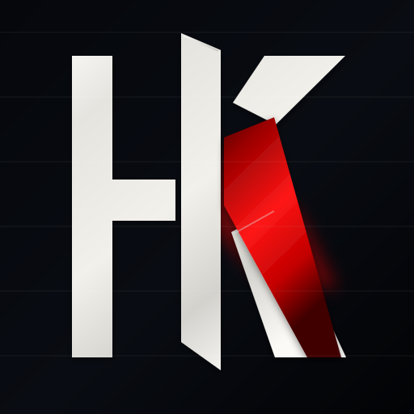
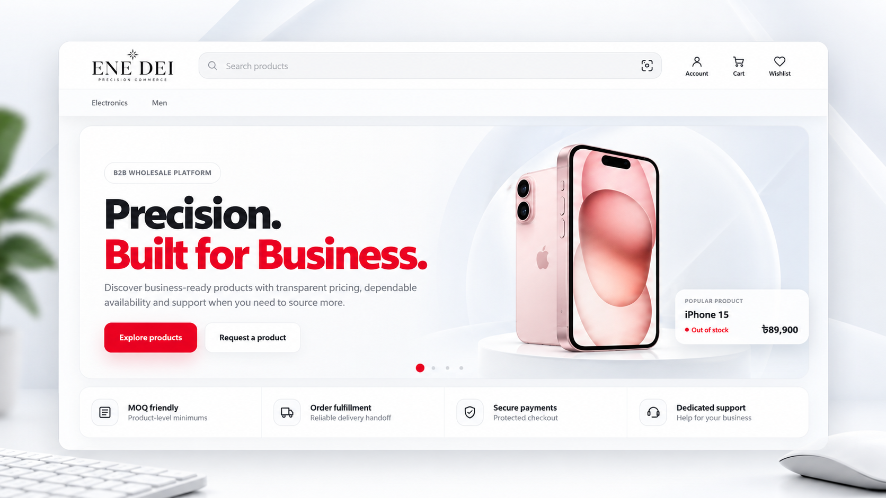
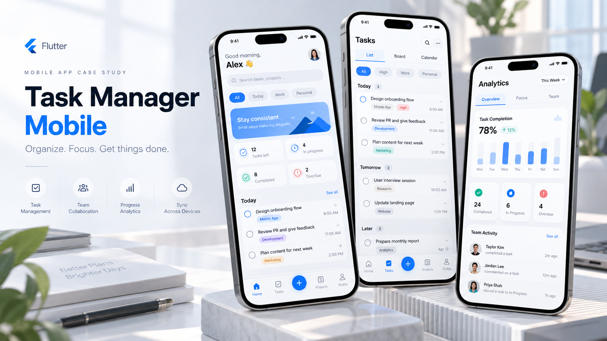
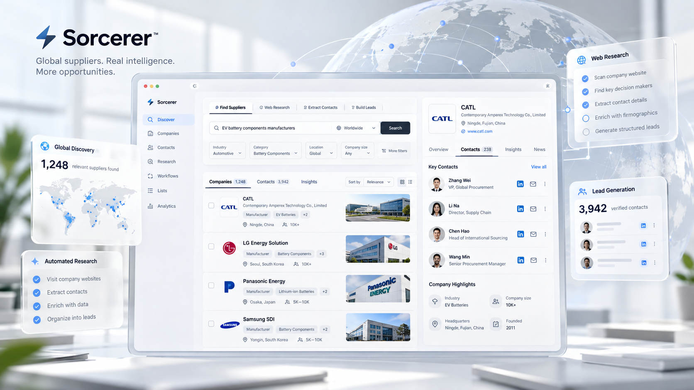
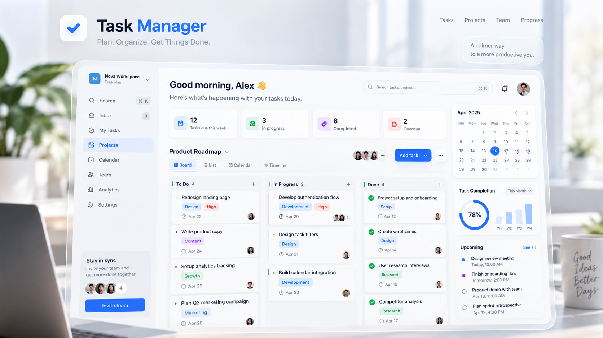

<div align="center">



# Hasan Kumrul — Portfolio

### Developer × Marketing Specialist

**I build digital products — and make them grow.**

A cinematic personal portfolio built with Nuxt, Vue and TypeScript, combining
software engineering, product thinking, SEO, analytics and growth.

<br />

[](https://nuxt.com/)
[](https://vuejs.org/)
[](https://www.typescriptlang.org/)
[](https://vercel.com/)
[](https://github.com/ashklucy5)

<br />

<p align="center">
  <a href="https://github.com/ashklucy5">
    
  </a>
  &nbsp;
  <a href="https://www.linkedin.com/in/kumrul-hasan-ankur">
    
  </a>
  &nbsp;
  <a href="mailto:kumrul_hasan@hotmail.com">
    
  </a>
</p>

</div>

---

## Overview

This repository contains the source code for my personal portfolio.

It is not designed as a conventional grid of projects. The site is built as a
**continuous visual narrative** that connects two parts of my professional work:

- **Development** — building products, systems and interfaces.
- **Marketing** — positioning, discoverability, analytics and growth.

Instead of separating those disciplines, the portfolio presents them as parts
of the same product lifecycle.

The experience is built around a continuous mountain environment, layered
parallax, restrained motion, editorial typography and translucent interface
surfaces.

---

## Design philosophy

The site follows a few deliberate principles.

**Content first.**  
Typography and hierarchy carry the experience rather than excessive decoration.

**One continuous world.**  
The background does not switch between unrelated section images. Multiple
photographic depth layers move at different speeds to create one persistent
environment.

**Motion with restraint.**  
Parallax, atmospheric haze, foliage and birds create depth without turning the
site into an animation demo.

**Engineering and growth together.**  
The portfolio reflects the way I work: product development, performance,
discoverability and measurement belong in the same conversation.

**Responsive by design.**  
Desktop, tablet and mobile layouts are intentionally adapted rather than simply
scaled down.

---

## Preview

### Featured projects

<table>
  <tr>
    <td width="50%">
      
      <br />
      <strong>E-commerce</strong>
    </td>
    <td width="50%">
      
      <br />
      <strong>Task Manager — Flutter</strong>
    </td>
  </tr>
  <tr>
    <td width="50%">
      
      <br />
      <strong>Sorcerer</strong>
    </td>
    <td width="50%">
      
      <br />
      <strong>Task Manager</strong>
    </td>
  </tr>
</table>

---

## Technology

| Area | Technology |
| --- | --- |
| Framework | Nuxt |
| UI | Vue |
| Language | TypeScript |
| Styling | CSS |
| Main typeface | Manrope Variable |
| Editorial typeface | Instrument Serif |
| Project data | GitHub API |
| Server API | Nuxt / Nitro |
| Images | WebP |
| Deployment target | Vercel |
| SEO | Nuxt SEO metadata + JSON-LD |
| Motion | CSS transforms + requestAnimationFrame |

The typography is self-hosted through Fontsource, avoiding a runtime dependency
on third-party font CDNs.

---

## Architecture

```mermaid
flowchart TD
    A[app/app.vue] --> B[FloatingNav]
    A --> C[CinematicBackground]
    A --> D[HeroSection]
    A --> E[RoleSection]
    A --> F[AboutSection]
    A --> G[ProjectsSection]
    A --> H[ExperienceSection]
    A --> I[ContactSection]

    G --> J[/api/github-projects]
    J --> K[GitHub REST API]

    L[app/data/profile.ts] --> D
    L --> E
    L --> F
    L --> H
    L --> I

    M[main.css] --> B
    M --> D
    M --> E
    M --> F
    M --> G
    M --> H
    M --> I
    M --> C
```

The application deliberately keeps the page composition simple.

`app/app.vue` acts as the composition root, while each major portfolio section
is isolated into its own Vue component.

---

## Project structure

```text
portfolio-nuxt/
│
├── app/
│   ├── app.vue
│   │
│   ├── assets/
│   │   └── css/
│   │       └── main.css
│   │
│   ├── components/
│   │   ├── AboutSection.vue
│   │   ├── CinematicBackground.vue
│   │   ├── ContactSection.vue
│   │   ├── ExperienceSection.vue
│   │   ├── FloatingNav.vue
│   │   ├── HeroSection.vue
│   │   ├── ProjectsSection.vue
│   │   ├── RoleSection.vue
│   │   ├── SceneCanvas.client.vue
│   │   └── SkillIcon.vue
│   │
│   └── data/
│       └── profile.ts
│
├── public/
│   ├── background/
│   │   ├── hero-sky.webp
│   │   ├── hero-mountains-back.webp
│   │   ├── hero-mountains-front.webp
│   │   ├── hero-architecture.webp
│   │   └── hero-foreground.webp
│   │
│   ├── images/
│   │   └── profile/
│   │
│   ├── projects/
│   │   ├── e-commerce.webp
│   │   ├── sorcerer.webp
│   │   ├── task-manager-flutter.webp
│   │   └── task-manager.webp
│   │
│   ├── favicon.svg
│   └── resume.pdf
│
├── server/
│   └── api/
│       └── github-projects.get.ts
│
├── .env.example
├── .gitignore
├── nuxt.config.ts
├── package.json
├── package-lock.json
└── tsconfig.json
```

---

# How the code works

## `app/app.vue`

`app.vue` is the main application shell.

It is responsible for:

- mounting the cinematic background;
- mounting the floating navigation;
- composing the portfolio sections;
- defining canonical metadata;
- Open Graph metadata;
- Twitter metadata;
- profile metadata;
- structured JSON-LD data.

The visible page remains component-driven rather than placing all portfolio
markup inside one large file.

The structure is approximately:

```vue
<CinematicBackground />
<FloatingNav />

<main>
  <HeroSection />
  <RoleSection />
  <AboutSection />
  <ProjectsSection />
  <ExperienceSection />
  <ContactSection />
</main>
```

This keeps page composition readable while allowing each section to evolve
independently.

---

## `CinematicBackground.vue`

The cinematic background is one of the core pieces of the site.

The environment is separated into multiple transparent photographic layers:

```text
Sky
 ↓
Distant mountains
 ↓
Front mountains
 ↓
Architecture
 ↓
Foreground vegetation / rocks
```

Each layer responds to the same normalized page progress value but moves by a
different distance.

Conceptually:

```ts
pageProgress = scrollY / maximumScroll
```

The CSS then consumes that value:

```css
transform:
  translate3d(
    calc(var(--page-progress) * -38px),
    calc(var(--page-progress) * 160px),
    0
  )
  scale(1.16);
```

Because foreground elements move farther than distant elements, the viewer
perceives depth.

### Why `requestAnimationFrame`?

Scroll events can fire many times between browser paints.

Instead of recalculating motion for every event, the component schedules no
more than one visual update per animation frame:

```ts
requestAnimationFrame(() => {
  updateScroll()
})
```

This reduces unnecessary work during fast scrolling.

The script also caches the document's maximum scroll distance and updates it
when layout dimensions change instead of measuring the entire document on
every scroll event.

---

## Atmospheric system

The background also contains subtle environmental motion:

- gradient haze;
- foliage movement;
- distant bird groups;
- pointer micro-parallax;
- evolving reading-light overlays.

The purpose is not to make individual animations noticeable.

Instead, they create enough movement for the environment to feel alive.

Mobile devices deliberately render fewer ambient elements to reduce GPU and
painting cost.

---

## Readability layers

A photographic background can easily interfere with text.

Instead of placing opaque backgrounds behind every section, the site uses
global lighting overlays:

```text
Light veil
Middle transition veil
Dark veil
```

Their opacity changes with page progress.

This makes the same environment gradually transition from a bright hero scene
into a darker reading environment while maintaining the illusion of one
continuous place.

---

## `FloatingNav.vue`

The navigation uses a restrained liquid-glass treatment.

Its responsibilities include:

- section navigation;
- active-state presentation;
- resume access;
- responsive collapse on smaller screens.

The navigation remains fixed while the content moves underneath it.

The blur level is intentionally kept below the original experimental version
to improve scroll performance while retaining the glass effect.

---

## `HeroSection.vue`

The hero establishes the central message:

> **I build digital products — and make them grow.**

It combines:

- professional positioning;
- development and marketing identity;
- primary actions;
- availability/status information;
- an interactive conversation-style introduction.

The conversation card is intentionally informational rather than a fake
chatbot. It provides a compact way to introduce the visitor to the portfolio.

---

## `RoleSection.vue`

This section explains the relationship between my two disciplines:

### Developer

Engineering, architecture, interfaces, APIs, databases and product systems.

### Marketing

SEO, analytics, content, campaigns, conversion and growth.

Rather than presenting these as unrelated skills, the section shows how both
contribute to the same product outcome.

Skills are rendered from data and paired with lightweight SVG icons through:

```text
SkillIcon.vue
```

No external icon library is required.

---

## `AboutSection.vue`

The About section combines:

- profile photography;
- professional perspective;
- working principles;
- editorial typography.

The portrait is stored as an optimized WebP asset and the layout changes from
a multi-column desktop composition to a compact mobile sequence.

---

## `ProjectsSection.vue`

Projects are not hardcoded entirely into the frontend.

The browser requests:

```text
/api/github-projects
```

which is handled by:

```text
server/api/github-projects.get.ts
```

The server endpoint retrieves project information from GitHub and converts it
into a frontend-friendly structure.

Featured repositories include:

```text
e-commerce
task-manager_flutter
sorcerer
task_manager
```

Local visual covers are associated with those repositories so the presentation
does not depend on GitHub README screenshots.

The project carousel supports:

- repository metadata;
- project descriptions;
- language information;
- live-project links where available;
- source-code links;
- optimized local artwork;
- horizontal responsive navigation.

---

## GitHub API strategy

The GitHub integration runs server-side.

This is important because an optional GitHub access token should never be
exposed to browser JavaScript.

The endpoint is designed to:

1. request the selected repositories;
2. tolerate individual repository failures;
3. normalize GitHub responses;
4. attach local project presentation data;
5. cache the response for a short period.

An access token is optional for public repositories, but using one provides a
higher GitHub API rate limit.

---

## `profile.ts`

Personal and professional information is centralized in:

```text
app/data/profile.ts
```

Instead of duplicating the same information across multiple components, the
portfolio can reuse one data source for things such as:

- name;
- location;
- email;
- GitHub;
- LinkedIn;
- developer skills;
- marketing skills;
- education;
- professional profile information.

This makes future updates much easier.

---

# Typography system

The portfolio uses two primary type families.

### Manrope

Used for:

- interface text;
- body copy;
- navigation;
- headings;
- buttons;
- project titles.

### Instrument Serif

Used selectively for:

- editorial emphasis;
- italic headline phrases;
- decorative numbering.

The design intentionally avoids using the serif everywhere.

Its role is to create contrast against Manrope and make key phrases feel more
editorial.

```css
--font-display: "Manrope Variable", sans-serif;
--font-body: "Manrope Variable", sans-serif;
--font-editorial: "Instrument Serif", serif;
```

Small technical labels use a restrained monospace stack.

---

# Styling architecture

Most visual design lives in:

```text
app/assets/css/main.css
```

The stylesheet contains:

- global design tokens;
- typography;
- cinematic background layers;
- glass surfaces;
- hero styling;
- role section;
- about section;
- projects;
- experience;
- contact;
- responsive breakpoints;
- reduced-motion behavior.

Central variables keep the visual identity consistent:

```css
--red: #b9222b;

--text-dark: #151614;
--text-dark-muted: rgba(21, 22, 20, 0.72);

--text-light: #f7f4ed;
--text-light-muted: rgba(247, 244, 237, 0.76);
```

---

# Performance decisions

The background is visually complex, but several deliberate optimizations keep
it production-friendly.

### Transform-based parallax

The photographic layers move using:

```css
transform: translate3d(...);
```

instead of continuously modifying layout properties.

### Animation frame throttling

Scroll and pointer calculations are scheduled with
`requestAnimationFrame`.

### Cached layout measurements

The application does not recalculate full document height on every scroll
event.

### Reduced backdrop blur

Large and repeated blur surfaces were reduced or removed from elements such as:

- project cards;
- skill pills;
- repeated tags;
- portrait container.

### Mobile simplification

Smaller devices render fewer atmospheric layers and bird groups.

### Optimized imagery

Large photographic assets use WebP.

### Reduced motion support

Visitors who enable:

```text
prefers-reduced-motion: reduce
```

receive a substantially reduced-motion experience.

---

# SEO

The portfolio includes technical SEO directly in the Nuxt application.

The implementation includes:

- document title;
- meta description;
- canonical URL;
- robots directive;
- Open Graph metadata;
- Twitter card metadata;
- social preview image support;
- author metadata;
- semantic sections;
- JSON-LD structured data.

Structured data represents the page as a:

```text
ProfilePage
```

with the primary entity represented as a:

```text
Person
```

including professional identity, profile image and social profiles.

---

# Environment variables

Create a local `.env` file based on:

```text
.env.example
```

Example:

```env
NUXT_PUBLIC_GITHUB_USERNAME=ashklucy5

# Optional.
# Keep this server-side. Never expose it through a NUXT_PUBLIC_* variable.
NUXT_GITHUB_TOKEN=

# Set this when the final production domain is available.
NUXT_PUBLIC_SITE_URL=
```

### Security

Never commit:

```text
.env
.env.local
GitHub tokens
API keys
credentials
```

The repository `.gitignore` excludes local environment files.

---

# Local development

Clone the repository:

```bash
git clone https://github.com/ashklucy5/Hk-Portfolio.git
```

Move into the project:

```bash
cd Hk-Portfolio
```

Install dependencies:

```bash
npm install
```

Start development mode:

```bash
npm run dev
```

Nuxt will display the local development URL in the terminal.

---

# Production build

Create the production build:

```bash
npm run build
```

Preview it locally:

```bash
npm run preview
```

Production preview is particularly important for evaluating animation and
scroll performance because development mode adds additional framework
overhead.

---

# Deployment

The project is designed for deployment on **Vercel**.

After importing the GitHub repository into Vercel, configure:

```env
NUXT_PUBLIC_GITHUB_USERNAME=ashklucy5
```

Optional server-side GitHub token:

```env
NUXT_GITHUB_TOKEN=your_token
```

Once the production domain is known, also configure:

```env
NUXT_PUBLIC_SITE_URL=https://your-domain.com
```

Do not use the GitHub token with the `NUXT_PUBLIC_` prefix.

That would expose it to browser JavaScript.

---

# Accessibility

The portfolio includes several accessibility-oriented decisions:

- semantic page sections;
- readable foreground/background contrast;
- responsive text sizing;
- visible interactive states;
- reduced-motion support;
- decorative scenery marked as non-content;
- responsive mobile layouts;
- conventional links for important actions.

The cinematic background exists as presentation rather than required content,
so the site remains understandable without its decorative motion.

---

# Responsive behavior

The site is designed across three broad interaction modes.

### Desktop

Full cinematic parallax, two-column compositions and complete navigation.

### Tablet

Reduced layouts, simplified grid structures and adapted readability treatments.

### Mobile

Single-column reading flow, reduced atmospheric rendering, compact navigation
and touch-oriented project browsing.

---

# Experimental scene component

The repository also contains:

```text
app/components/SceneCanvas.client.vue
```

This was used during experimentation with a client-side graphical scene.

It is intentionally **not mounted in the production page composition**.

The current production environment is implemented using the lighter layered
photographic system in:

```text
CinematicBackground.vue
```

The experimental component remains in the repository for future visual
experiments.

---

# Featured work

### E-commerce

A commerce-focused application demonstrating frontend and product experience
work.

**Live frontend:**  
https://frontend-ecru-ten-70st7vvrxx.vercel.app/

**Repository:**  
https://github.com/ashklucy5/e-commerce

---

### Task Manager — Flutter

A task-management application built around Flutter.

**Repository:**  
https://github.com/ashklucy5/task-manager_flutter

---

### Sorcerer

One of the featured software projects surfaced directly through the GitHub
integration.

**Repository:**  
https://github.com/ashklucy5/sorcerer

---

### Task Manager

An additional task-management project included in the portfolio's selected
GitHub work.

**Repository:**  
https://github.com/ashklucy5/task_manager

---

# Professional focus

```text
Development
├── Product engineering
├── Frontend
├── Backend
├── APIs
├── Databases
├── Performance
└── Product systems

Marketing
├── SEO
├── Analytics
├── Content
├── Campaigns
├── Conversion
└── Growth

                  ↓

             Product outcome
```

The portfolio itself is an example of this intersection: engineering choices,
performance, presentation, SEO and positioning are treated as parts of the
same product.

---

## Contact

**Hasan Kumrul**

Shenzhen, China · Working globally

<p align="center">
  <a href="https://github.com/ashklucy5">
    
  </a>

  <a href="https://www.linkedin.com/in/kumrul-hasan-ankur">
    
  </a>

  <a href="mailto:kumrul_hasan@hotmail.com">
    
  </a>
</p>

---

<div align="center">

### Built with code, product thinking and growth in the same room.

<br />

**Hasan Kumrul**

</div>